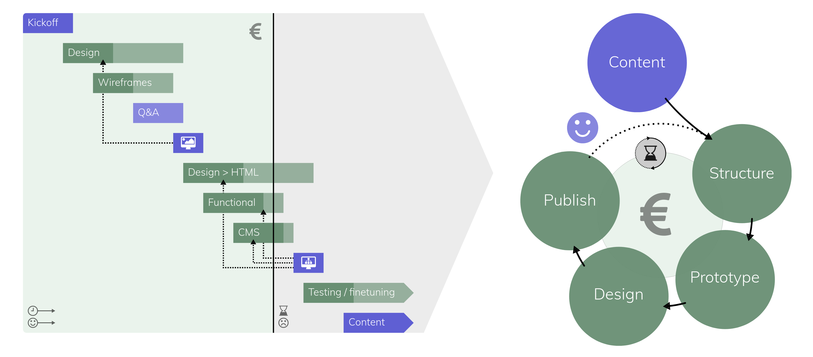

# Create MODX.org content first

**_Note: This recommendation is a DRAFT for consideration of the MODX Advisory Board._**

By taking on an iterative design process that starts with creating, structuring and prototyping the content, we can launch modx.org sooner and make sure the content reflects _exactly_ what the MODX community wants to say.

Editor: Hugo Peek
First published draft: July 28, 2017

## Goal of Recommendation

There are a couple of desired outcomes here:

- Go live soon
- Put the emphasis on the job people are trying to get done
- Create a modx.org that reflects the voice of the entire community

I will expand on these points in the Recommendation section below.

## Relevant Recommendations

https://github.com/modxcms/mab-recommendations/blob/master/08-modx-org-website.md

## Recommendation

My recommendation is to shift to a design process for modx.org that starts with content. This means: creating, structuring, questioning and prioritizing content first, then prototype it to see how it comes out and interacts, and only apply the design layer at the very end, before it gets published. This will be a circular, iterative process, meaning we can continuously repeat these steps to improve existing content after receiving feedback. Or to expand upon it by adding information / functionality or additional layers of design. I'll try to outline the main benefits of this method below.

### Go live soon

There is a need for the MODX community to be properly represented and backed by a decent community website. I won't go into that too much because the MAB has already recognized that, but I do feel that there's some urgency behind this need. I've heard several community members mention that they're getting comments on the new modx.com (myself included) and that they don't know where to point to when trying to convince potential clients to choose MODX.

So in my opinion: as soon as we have something worthy of publishing, we should be able to publish it. In SF unicorn slang, this would be called an MVP (minimum viable product). I'm not a big supporter of the whole "move fast and break things" mentality surrounding it, but in today's fast moving world the MVP concept of getting your v1.0 online quickly and then continuously improve on it definitely has its merits. I feel we are falling behind now on what other platform are offering. While drafting these thoughts, I stumbled on the Craft CMS project again, and their current [homepage](https://craftcms.com/) had me moving around in my seat with a slightly elevated heart rate for a good couple of minutes. Their opening heading is "Put your content first." That literally says what I'm trying to say here. The good news is that all the things Craft does well can also be done with MODX, and we've been doing it for quite a while longer even. We provide all the benefits, we only need to concentrate that into effective, high quality content still. Sooner, rather than later. Which brings me to the next point:

### Put the emphasis on the job people are trying to get done

I don't know if you're familiar with jobs-to-be-done.. The basic premise is that:

>People buy products and services to get a “job” done. The key to success is understanding the real job customers are using your product for.
>
> [source](https://www.intercom.com/books/jobs-to-be-done#whats-inside)

This methodology originaly emerged in traditional product marketing, but its being applied to software development now too, with Intercom being a big advocate of that. I can highly recommend anyone to [watch this video](https://youtu.be/k0NRo3yLqxM) or read this [ebook](https://www.intercom.com/books/jobs-to-be-done).

And I feel we need to apply this to modx.org too. We need to identify what problems (potential) MODX users are trying to solve and drill down into the deeper motivations behing these questions. Why is it a problem for them? And what are they trying to accomplish?

It's tempting to just showcase all the features MODX has, but that will leave it up to the visitor to figure out how to use these features in their situation (this should also be there of course; tutorials, but later on). Features often don't fully explain why they are there in the first place. Why do I need contexts? Or TVs? If we instead ask ourselves: which problems can you hire MODX for to solve, that would put us much closer to the reality of (potential) users and "lure" them into giving MODX a spin (or any of its extras, or more advanced features for that matter).

The initial recommendation already highlights this for the homepage:

>Overview “What is MODX and why do I wanna use it?” from perspectives from each target group (editors, managers, developers)

This is good. I also feel we should start with that, and that we probably need to divide our audience in target groups. The rest of the content structure also seems to be a good starting point, so good job to everyone involved! *(And I'm not just saying that because there's a "but" coming.. Because you just feeeeel there's a but coming.. No? ;))*

But...

After that, there's no further reference to the content until:

> **To Dos after acceptance**

> - Start a "modx.org" working group
> - Create a public repository at github.com/modxcms/modx.org and add MAB members as Collaborators
> - Explore hosting options
> - Define tech-stack
> - Define rules for merging PRs / new **content**
> - Wireframing & Screendesign
> - Templating & Integration

It refers to defining rules for accepting new content (which is good), but it doesn't say anything about any actual content just yet. Now, please forgive me if I sound rude or start stepping on any toes, but this is where the content first approach starts swimming against the stream a little bit. In the above model, we basically say: define our specifications, start wireframing and designing something for those specs, and on agreement we integrate this into the CMS. Which I assume in this case, will be MODX, and I also assume that adding the content will be next..?

#### Content first

The problem with this model is that content is often being treated as an afterthought; something that will figure itself out when the time comes. By Toutatis, it will not. Why do we leave the (arguably) most important part of a project to the very end? I've been exploring this topic for a few years now and I'm seeing this pattern over and over again. A project is treated as something that needs to go from A to Z, with the C for Content being guestimated and interpolated along the way (dummy content is the ultimate embodyment of this). This might work fine for small, predictable websites or redesigns, but it will get you in trouble in projects that require strategic content. The result is often: content missing the mark or proving to be difficult to implement within an already finished structure and design. Let's imagine for example, that we are all excited about this job-to-be-done thing mentioned above and we want to apply that to our content. But we do it _after_ going through the whole design and development phase.. What if the jobs-to-be-done approach opens our eyes to a completely different way of communicating? One that would in turn lead to a different content structure and design altogether?

This pattern is often referred to as the "waterfall model", which represents a linear flow from start to finish. It may not manifestate itself as dramatically as described above (with a complete redesign), but unless you have some very "watertight" specifications at the start of a project, issues will appear in various little ways. Ideas come up, minds get changed, that's how it goes. And the longer you wait with adding final content, the higher the chances of your product not being a good fit for that content anymore. I'm working on creating some content about this topic to publish on my own website too at the moment and made these graphics to explain it a bit more visually:

 

What a content first approach essentially proposes, is to start with content (obviously) and then move through the phases of structuring it, prototyping it and _only in the end_ designing it to be ready for publication. This is a **circular process**, which is based on available budget and time and can be repeated / expanded upon in further iterations if needed.

The result: design that fits the content, not the other way around. And if you're lucky: faster publications.. Because that also depends on how easy your team / client can adapt to this approach. 

Is it easy? No. I've had some heated arguments with clients, project managers and designers (especially Photoshop oriented ones) in content first projects I worked on. And not all of these projects went as smoothly as I'm picturing it now in theory. But they all worked out in the end. Especially if the client or content editor really developed a good feel for this concept, things started to gain momentum very quickly. I was surprised by how inventive and creative the editors could be, and even humbled sometimes by how much trust they put in me / us that this was the way to go, even though they had no idea of the final outcome yet and things seemed to be a complete mess still at that point. One editor for example, couldn't find a way to make something output all the required data. "I wrote it all down instead and made it blue, so you can add it later". This simple consideration turned out to work perfectly, and led me to build a status grid, in which we could keep track of all the progress per resource.

OK, I feel another bookwork coming, so I'll move on now. But it works, trust me ;)

### Create a modx.org that reflects the voice of the entire community

This starts with getting feedback from the community early on. We then need to be able to implement that feedback quickly in the next deployment cycle, so contributors are encouraged to keep contributing and in turn get other member excited to do the same. It should be easy for anyone to add showcase sites, tips and tricks, how-to guides, etc to modx.org, by providing clear templates and contributing guides.

This may not directly related to the content first recommendation anymore, so I'll save that for a different draft. (Yes, there will be more..)

---

**Closing comments**

I think now would be a good time to start the dialoge about this subject. I'm curious if anyone else has experience with this already and I'm also available to answer any questions of course, or provide further resources and clarifications.

A few question that come to mind now for the modx.org working group:

- I don't know what's been discussed and done behind the scenes already in terms of content, and realize the modx.org recommendation might also still be early stage.. But is there anything available already?
- I mentioned Craft and Intercom as good examples.. Do you have any favorites too that hit the nail on the head really well? Should we create a doc maybe of well designed / executed examples for inspiration / to learn from?

And to anyone reading:

- If someone would ask you: what job is your client hiring MODX for? And what job are _you_ hiring MODX for? What would you answer?
- Any content strategists / content marketeers, information architects or other types of content wranglers and enthousiasts in the house?

And I'm reading from the Recommendations process doc that I need a member of the MAB to sponsor this recommendation, so... Anyone sharing my feelings that good content should be at the center (and the start) of a new modx.org too, and wants to sponsor this recommendation?
